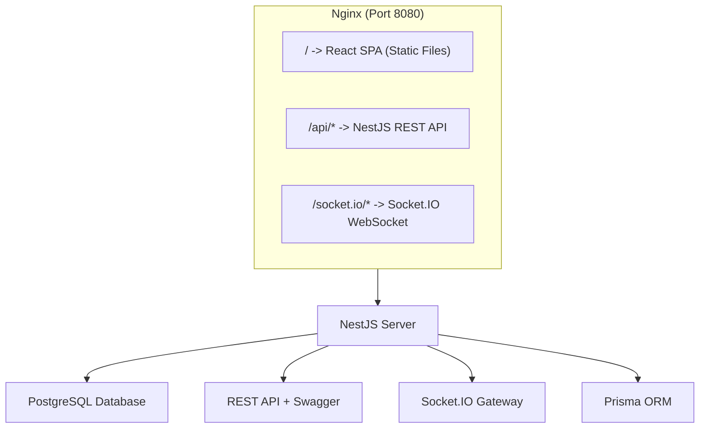

# ChatKet - Open Source Real-time Chat

<div align="center">


A modern, open-source real-time chat application with rooms, direct messages, and rich features.

[🚀 Live Demo](https://chatket.bariscanatakli.com) · [📖 Documentation](./architecture-notes.md) · [🤝 Contributing](#contributing)

</div>

---

## ✨ Features

### Core Chat
- 💬 **Real-time Messaging** - Socket.IO powered instant messaging
- 🏠 **Chat Rooms** - Create and join public rooms
- 👤 **Direct Messages** - Private 1-on-1 conversations
- 🔔 **Notifications** - Real-time DM notifications with toast alerts

### Rich Messaging
- 😀 **Reactions** - React to messages with emojis
- ↩️ **Reply Threads** - Reply to specific messages
- 📍 **Unread Indicators** - Track unread messages per room
- ⌨️ **Typing Indicators** - See when others are typing

### User Experience
- 🌙 **Dark/Light Theme** - System-aware theme switching
- 👥 **User Profiles** - Customizable profiles with avatars and bios
- 🟢 **Presence Status** - Online/Away/Offline indicators
- 📱 **Responsive Design** - Works on desktop and mobile

### Security & Performance
- 🔐 **JWT Authentication** - Secure token-based auth
- 🛡️ **Rate Limiting** - Protection against spam (5 msg/10s)
- 🔄 **Message Deduplication** - Exactly-once delivery
- 🔌 **Auto Reconnect** - Seamless reconnection with state recovery

## 🛠️ Tech Stack

| Layer | Technology |
|-------|------------|
| **Frontend** | React 18 + TypeScript + Vite + Tailwind CSS |
| **Backend** | NestJS + Socket.IO + Prisma |
| **Database** | PostgreSQL |
| **Deployment** | Docker Compose with Nginx |
| **Documentation** | Swagger/OpenAPI |

## 🚀 Quick Start

### Using Docker (Recommended)

```bash
# Clone the repository
git clone https://github.com/bariscanatakli/ChatKet.git
cd ChatKet

# Start all services
docker compose up -d --build

# Open in browser
open http://localhost:8080
```

That's it! The app is running at http://localhost:8080

### Manual Setup

#### Prerequisites
- Node.js 18+
- PostgreSQL 15+
- npm or yarn

#### 1. Start Database

```bash
docker compose up postgres -d
```

#### 2. Setup Server

```bash
cd server
npm install
cp .env.example .env
npx prisma generate
npx prisma db push
npm run start:dev
```

#### 3. Setup Client

```bash
cd client
npm install
npm run dev
```

- Client: http://localhost:5173
- Server API: http://localhost:3000
- API Docs: http://localhost:3000/docs

## 📁 Project Structure

```
chatket/
├── docker-compose.yml        # Full stack deployment
├── README.md                 # This file
├── LICENSE                   # MIT License
│
├── server/                   # NestJS Backend
│   ├── prisma/
│   │   └── schema.prisma     # Database schema
│   └── src/
│       ├── auth/             # Authentication
│       ├── chat/             # Real-time messaging
│       ├── rooms/            # Room management
│       ├── dm/               # Direct messages
│       ├── users/            # User profiles
│       └── prisma/           # Database service
│
└── client/                   # React Frontend
    └── src/
        ├── components/       # UI Components
        ├── hooks/            # Custom React hooks
        ├── services/         # API & Socket clients
        ├── contexts/         # React contexts
        └── types/            # TypeScript types
```

## 🔧 Configuration

### Environment Variables

| Variable | Default | Description |
|----------|---------|-------------|
| `POSTGRES_USER` | chatket | Database username |
| `POSTGRES_PASSWORD` | chatket_secret | Database password |
| `POSTGRES_DB` | chatket | Database name |
| `JWT_SECRET` | (auto-generated) | JWT signing secret |
| `PORT` | 8080 | Application port |

### Default Settings

| Setting | Value |
|---------|-------|
| JWT Expiry | 7 days |
| Rate Limit | 5 messages / 10 seconds |
| Mute Duration | 30 seconds |
| Presence Timeout | 30 seconds |
| Max Message Length | 500 characters |

## 📖 API Documentation

Interactive API documentation is available via Swagger:
- **Development**: http://localhost:3000/docs
- **Production**: http://localhost:8080/api/docs

### Key Endpoints

| Method | Endpoint | Description |
|--------|----------|-------------|
| POST | `/auth/request-code` | Request login code |
| POST | `/auth/verify-code` | Verify code & get JWT |
| GET | `/rooms` | List user's rooms |
| POST | `/rooms` | Create a room |
| POST | `/rooms/:id/join` | Join a room |
| GET | `/rooms/:id/messages` | Get message history |
| GET | `/dm/conversations` | List DM conversations |
| GET | `/users/profile` | Get user profile |

### Socket Events

| Event | Direction | Description |
|-------|-----------|-------------|
| `room:join` | Client → Server | Join a room |
| `room:leave` | Client → Server | Leave a room |
| `message:send` | Client → Server | Send a message |
| `message:new` | Server → Client | New message received |
| `dm:send` | Client → Server | Send direct message |
| `dm:new` | Server → Client | New DM received |
| `typing:start` | Client → Server | User started typing |
| `typing:stop` | Client → Server | User stopped typing |

## 🏗️ Architecture



## 🤝 Contributing

Contributions are welcome! Please feel free to submit a Pull Request.

1. Fork the repository
2. Create your feature branch (`git checkout -b feature/AmazingFeature`)
3. Commit your changes (`git commit -m 'Add some AmazingFeature'`)
4. Push to the branch (`git push origin feature/AmazingFeature`)
5. Open a Pull Request

## 📄 License

This project is licensed under the MIT License - see the [LICENSE](LICENSE) file for details.

## 🙏 Acknowledgments

- [NestJS](https://nestjs.com/) - A progressive Node.js framework
- [React](https://reactjs.org/) - A JavaScript library for building UIs
- [Socket.IO](https://socket.io/) - Real-time bidirectional event-based communication
- [Tailwind CSS](https://tailwindcss.com/) - A utility-first CSS framework
- [Prisma](https://prisma.io/) - Next-generation ORM

## 📐 Architecture & Design

Want to understand how ChatKet works under the hood? Check out the detailed architecture documentation:

📖 **[Architecture Notes](./architecture-notes.md)** - Deep dive into system design, data models, WebSocket events, and scalability considerations.

---

<div align="center">

Made with ❤️ by [Barış Can Ataklı](https://github.com/bariscanatakli)

[](https://github.com/bariscanatakli)
[](https://www.linkedin.com/in/bar%C4%B1%C5%9F-can-atakl%C4%B1-414184203/)

</div>
